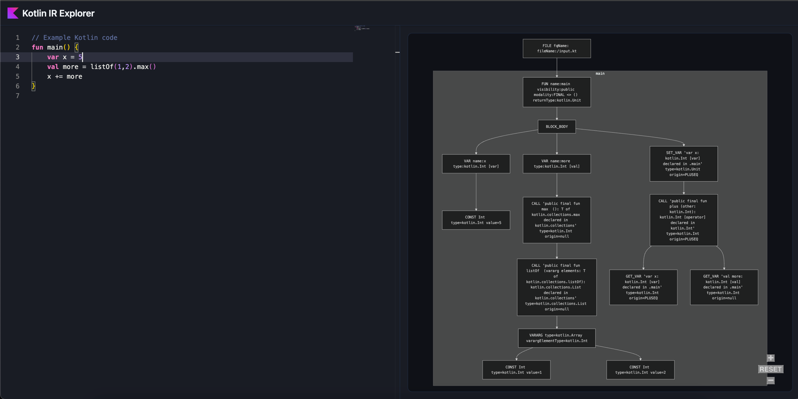
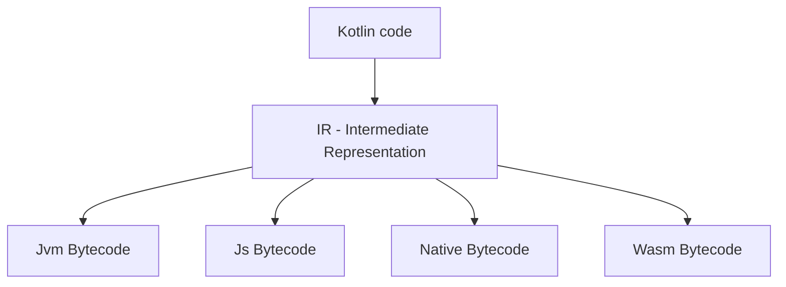

# Kotlin IR Explorer



Visualize Kotlin IR (Intermediate Representation) as a Mermaid graph, for use in Kotlin Compiler Plugin development

## How?

Run `docker run -p 8080:8080 yairm210/kotlin-ir-explorer` to start the server, and then open your browser at [http://localhost:8080](http://localhost:8080).

## What?

Kotlin compilation is a multi-step process that converts Kotlin code to an intermediate representation (IR) before generating bytecode.

Usually, the final generated results are available for examination, but the **intermediate code** is not available to the developer. No longer! :D



## Development

There are 3 parts to this project:

- **core** comprises the code that converts Kotlin code to IR, and IR to a Mermaid graph
- **server** is a Ktor server that serves an endpoint for such a conversion, and a static site for code input and graph output
- **server/src/main/resources/static** is a simple React app (kudos [nano-react-app!](https://github.com/nano-react-app/nano-react-app)) that provides a UI for the server, with further documentation in its readme

To build the static site:

```shell
cd server/src/main/resources/static
npm install
npm run build
```

You can also develop just the static site using `npm run start` for hot reloading.

To run the server:

```shell
./gradlew :server:run
```
